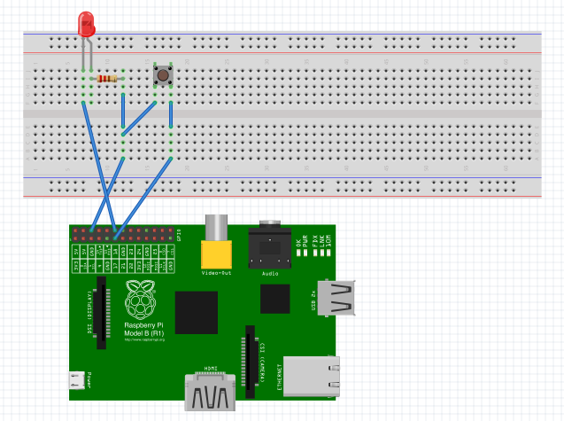

# Button and LED

## Hardware

1. Connect the button to GND and a IO port. 2. Connect the LED to a resistor, GND and another IO port. See references below.



References: 

http://razzpisampler.oreilly.com/ch07.html 

http://razzpisampler.oreilly.com/ch03.html#SEC7.1
s

## Software
1. Installation

```
sudo apt-get install python-dev
sudo apt-get install python-rpi.gpio
```

2. Create a new project_01.py file using nano:
```
sudo nano project_01.py
```

3. Run python script:
```
sudo python project_01.py
```

